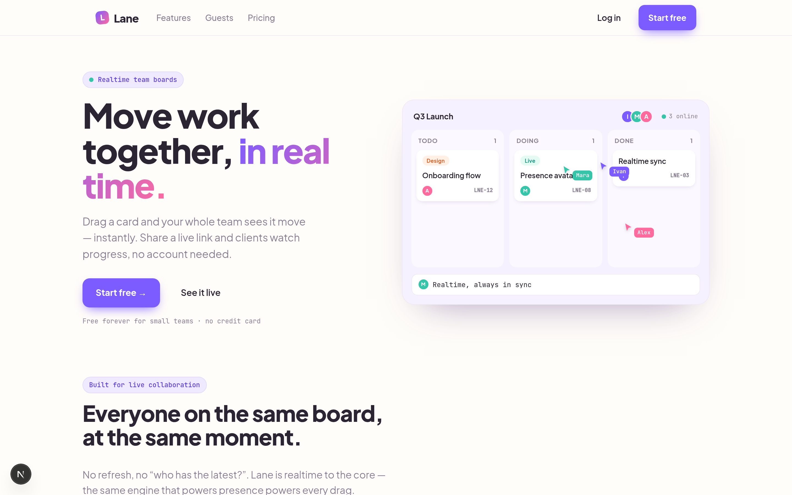
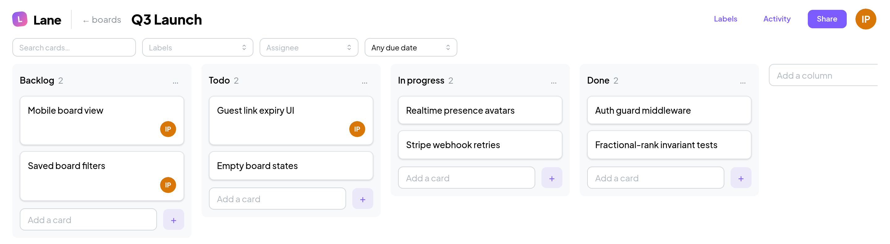
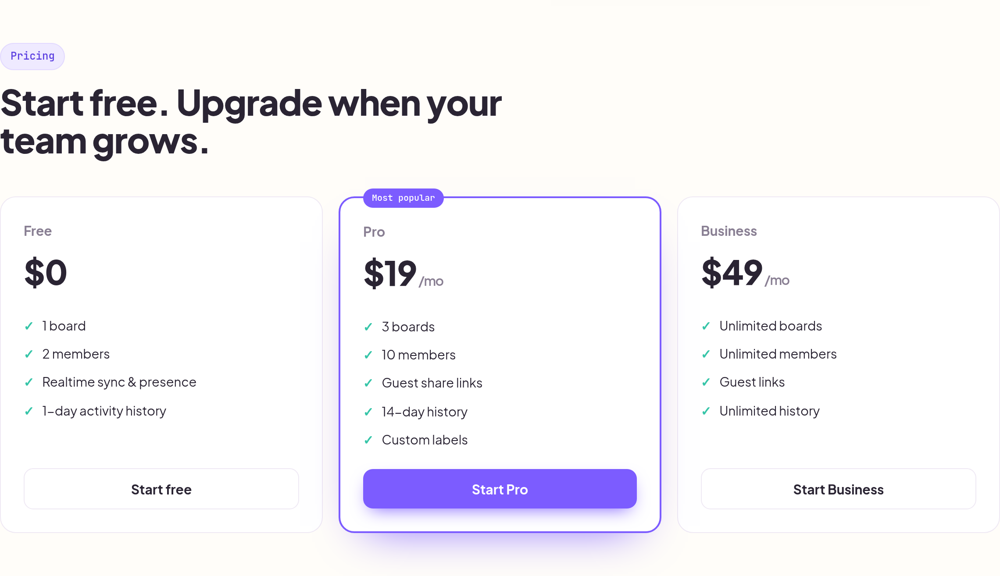

# Lane

**Realtime team boards with guest links.** Drag a card and your whole team sees it move instantly; share a read-only link and clients watch progress live — no account needed. Lane is a production-shaped SaaS MVP: multi-tenant auth, realtime collaboration, plan-gated billing, and a marketing landing page, on a CQRS NestJS backend and a Next.js front end.

**🔗 Live demo → [lane.iberezh.site](https://lane.iberezh.site)**

[](https://lane.iberezh.site)




## Features

- **Realtime sync** — Socket.IO room per board; every domain event is mapped to a typed wire message (`realtime/wire.ts`, a registry — adding an event there is the single step to broadcast it) and fanned out to everyone viewing the board.
- **Optimistic drag & drop** — the client predicts the server's outcome with the *same* deterministic fractional-ranking function, applies it instantly through the same reducer that handles server events, and rolls back if the API rejects. In the common case the confirming broadcast is a visual no-op.
- **Conflict-safe ordering** — fractional ranking keys over `a–z` (`kanban/ranking/rank.ts`): a move writes only the moved row, so concurrent drags from different users can't trample each other. Verified with a randomized 2000-insert invariant test.
- **Live presence** — join a board with a name and color; avatars update live on join, leave, and disconnect.
- **Workspaces & auth** — JWT in an http-only `lane_token` cookie; every board, column, card, and label is scoped to an account.
- **Guest share links** — publish a board as a read-only, live `/share/[token]` page with optional expiry; guests join the socket room through a token-validated path, no account required.
- **Cards in depth** — labels, assignees, due dates, checklists/subtasks, comments with @mentions, an activity feed, and in-app notifications.
- **Plans & billing** — Free / Pro / Business via Stripe Checkout + customer portal + a signature-verified webhook, with a keyless mock provider for local runs. Limits are enforced server-side.
- **Board tooling** — per-column WIP limits and text/label/assignee/due filtering mirrored to the URL.
- **Marketing landing** — animated, SSR'd landing page at `/` with self-playing live-board demos and pricing.

## Engineering signals

- **CQRS write/read split** — controllers dispatch through `CommandBus`/`QueryBus`; the realtime layer is just an `EventBus` subscriber, so command handlers never touch a socket.
- **Optimistic concurrency** — the client predicts a move with the *same* deterministic ranking function the server uses, applies it through one pure reducer that also handles server broadcasts, and rolls back on rejection.
- **Conflict-safe ordering** — fractional rank keys mean a move writes only the moved row; correctness is pinned by a randomized 2000-insert invariant test.
- **Horizontally scalable realtime** — Socket.IO with an optional Redis adapter; presence is derived from room membership (`fetchSockets`), so rooms, broadcasts, and presence all span instances (verified with two instances on one Redis).
- **Multi-tenant from the ground up** — JWT cookie auth, per-account scoping, and plan limits enforced in the handlers (not just the UI).
- **Stripe with a keyless mock fallback** — Checkout, Billing Portal, and a signature-verified webhook; the whole flow runs in tests/CI without any Stripe keys.
- **Typed and tested** — strict TypeScript (no `any`), 61 unit + 23 integration tests (incl. a two-socket realtime e2e), Biome, CI on every PR.

## Screenshots

The board — realtime columns, cards, assignees, filtering, and live presence:



Plans, gated server-side:



## Plans

| | Free | Pro ($19/mo) | Business ($49/mo) |
| --- | --- | --- | --- |
| Boards | 1 | 3 | Unlimited |
| Guest share links | — | ✓ | ✓ |
| Custom labels | — | ✓ | ✓ |
| Activity history | 1 day | 14 days | Unlimited |

Limits live in `billing/plan.limits.ts` and are enforced in the command handlers (e.g. `kanban/commands/board.handlers.ts`, `share/share.command-handlers.ts`), not just the UI.

## Tech specification

| Component | Technology | Details |
| --- | --- | --- |
| Web framework | **Next.js 15** (App Router) | SSR landing + client app; **React 19** |
| UI | **Mantine v8** + TypeScript | theme tokens; Plus Jakarta Sans + JetBrains Mono via `next/font` |
| State / forms | **Zustand 5**, **React Hook Form 7** | the board store is the single client-side source of truth |
| Drag & drop | **dnd-kit** (core 6 / sortable 10) | cards and columns, applied optimistically |
| Animation | **Framer Motion 12** | landing demos, scroll reveals, auth transitions |
| Realtime client | **socket.io-client 4** | one shared connection on the API origin |
| Language | **TypeScript** (strict) | `noUncheckedIndexedAccess`, `exactOptionalPropertyTypes`, no `any` |
| API framework | **NestJS 11** + **`@nestjs/cqrs` 11** | controller → `CommandBus`/`QueryBus` → handler → repository → `EventBus` |
| Realtime server | **Socket.IO 4.8** (`@nestjs/websockets`) | room per board; domain events → wire registry → broadcast |
| Horizontal scaling | **`@socket.io/redis-adapter` 8** + **ioredis 5** | rooms/broadcasts/presence span instances when `REDIS_URL` is set; presence via `fetchSockets` |
| ORM | **Drizzle ORM 0.44** + drizzle-kit | typed schema + SQL migrations |
| Database | **PostgreSQL 16** (`pg`) | multi-tenant: account → boards → columns → cards |
| Ordering | **fractional rank keys** (`a`–`z`) | a move writes only the moved row; randomized 2000-insert invariant test |
| Auth | **JWT** (`@nestjs/jwt` + `passport-jwt`) | httpOnly cookie `lane_token`, `SameSite=Lax`; **bcryptjs** hashing with a constant-time dummy compare |
| Authorization | per-account scoping + plan gating | checked in the handlers; **server-enforced** Free/Pro/Business limits |
| Billing | **Stripe 22** (Checkout + Billing Portal + webhooks) | subscription lifecycle synced from the trusted price id; **mock fallback** when no key is set |
| Validation | **class-validator** + class-transformer | global `ValidationPipe` (`whitelist`, `transform`) |
| API docs | **Swagger** (`@nestjs/swagger`) | OpenAPI UI at `/api/v1/docs` |
| Tests | **Vitest** + Supertest + socket.io-client | 61 unit + 23 integration (REST lifecycle + two-socket realtime e2e) |
| Tooling | **pnpm** workspaces · **Biome** · **Husky** · **GitHub Actions** | CI on every PR; Node ≥ 22 |

## Architecture

```
   REST (commands & queries)                    Socket.IO
┌──────────┐   POST /api/v1/cards/:id/move   ┌─────────────┐
│  Next.js │ ───────────────────────────────▶│  Controller │
│  client  │                                 └──────┬──────┘
└────▲─────┘                                  CommandBus
     │                                        ┌──────▼──────┐     ┌────────────┐
     │  board:event                           │   Handler   │────▶│  Postgres  │
     │  (room broadcast)                      └──────┬──────┘     └────────────┘
     │                                          EventBus
┌────┴─────┐                                  ┌──────▼──────┐
│ Gateway  │◀─────────────────────────────────│ EventsRelay │
└──────────┘         toWire(event)            └─────────────┘
```

- Write path: controller → `CommandBus` → handler → repository → `EventBus`.
- Read path: `QueryBus` → `GetBoard` assembles the board view in rank order.
- `KanbanEventsRelay` is the only bridge between domain events and sockets — command handlers never touch a socket.
- Presence is derived from Socket.IO room membership (`fetchSockets`), so with the Redis adapter (`REDIS_URL`) rooms, broadcasts, and presence all span multiple instances.
- Auth is a Passport JWT strategy over the `lane_token` cookie; account scoping is checked in the handlers.
- Billing swaps a `StripeBillingProvider` for a `MockBillingProvider` at module init based on whether `STRIPE_SECRET_KEY` is set.
- The client feeds both server broadcasts *and* its own optimistic predictions through one pure reducer (`stores/apply-event.ts`).

## Run it with Docker

```bash
docker compose up --build
```

- Web → [localhost:3002](http://localhost:3002)
- API → [localhost:4000](http://localhost:4000)
- Swagger UI → [localhost:4000/api/v1/docs](http://localhost:4000/api/v1/docs)

Migrations run automatically when the API container starts, and billing runs in mock mode unless you supply Stripe keys (`STRIPE_SECRET_KEY=sk_test_… docker compose up --build`).

## Local development

```bash
pnpm install
docker compose up -d postgres          # POSTGRES_PORT=5433 docker compose up -d postgres   # if 5432 is taken
cp .env.example .env                    # set JWT_SECRET; adjust DATABASE_URL if you changed the port
pnpm --filter @kanban/api db:migrate
pnpm dev                                # API on :4000, web on :3002
```

To exercise real Stripe checkout, drop test keys into `.env` and run `pnpm --filter @kanban/api stripe:setup` to create the Pro/Business prices and write their IDs back.

## Environment

| Variable | Required | Default | Notes |
| --- | --- | --- | --- |
| `DATABASE_URL` | yes | — | Postgres connection string |
| `JWT_SECRET` | yes | — | ≥16 chars; signs the `lane_token` cookie |
| `PORT` | no | `4000` | API port |
| `CORS_ORIGIN` | no | `http://localhost:3002` | Browser origin allowed to send credentials |
| `APP_URL` | no | = `CORS_ORIGIN` | Public origin for billing return URLs |
| `REDIS_URL` | no | — | Set to enable the Socket.IO Redis adapter (multi-instance) |
| `STRIPE_SECRET_KEY` | no | — | Unset ⇒ keyless mock billing |
| `STRIPE_WEBHOOK_SECRET` | no | — | Verifies webhook signatures |
| `STRIPE_PRICE_PRO` / `STRIPE_PRICE_BUSINESS` | no | — | Stripe Price IDs (`stripe:setup` generates them) |
| `NEXT_PUBLIC_API_URL` | no | `http://localhost:4000/api/v1` | Browser-facing API base, inlined into the web build |

## Layout

```
apps/
  api/   NestJS + CQRS + Drizzle + Socket.IO + Stripe billing
  web/   Next.js App Router + Mantine (app, share view, landing)
```

## Tests

```bash
pnpm test                                  # unit: ranking invariants, handlers, billing
pnpm --filter @kanban/api test:integration # REST lifecycle + two-socket realtime e2e (needs Postgres)
pnpm type-check && pnpm lint
```

CI runs type-check → lint → unit → migrate → integration → build on every PR.

## License

MIT
