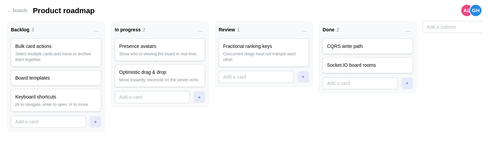

# Realtime Kanban

A realtime collaborative Kanban board. Open the same board in two windows, drag cards around, and watch both stay in sync — optimistic updates, conflict-safe ordering, and live presence included.



## Highlights

- **CQRS backend** — REST controllers dispatch commands and queries through `@nestjs/cqrs`; command handlers persist via Drizzle and publish domain events. The realtime layer is just an event subscriber: the write path never touches a socket.
- **Realtime sync** — Socket.IO room per board; every domain event is mapped to a typed wire message (`realtime/wire.ts`, a registry — adding an event there is the single step to broadcast it) and fanned out to everyone viewing the board.
- **Optimistic drag & drop** — the client predicts the server's outcome with the *same* deterministic fractional-ranking function, applies it instantly through the same reducer that handles server events, and rolls back if the API rejects. In the common case the confirming broadcast is a visual no-op.
- **Conflict-safe ordering** — fractional ranking keys over `a–z` (`kanban/ranking/rank.ts`): a move only writes the moved row, so concurrent drags from different users can't trample each other. Verified with a randomized 2000-insert invariant test.
- **Presence** — join a board with a name and color; avatars update live on join, leave, and disconnect.

## Stack

| Layer | Tech |
| --- | --- |
| Frontend | Next.js (App Router), TypeScript, Mantine, Zustand, React Hook Form, dnd-kit, socket.io-client |
| Backend | NestJS, `@nestjs/cqrs`, Socket.IO, class-validator, Swagger |
| Database | PostgreSQL, Drizzle ORM (drizzle-kit migrations) |
| Tooling | pnpm workspaces, Biome, Vitest, Husky, GitHub Actions |

## Architecture

```
   REST (commands & queries)                    Socket.IO
┌──────────┐   POST /api/v1/cards/:id/move   ┌─────────────┐
│  Next.js │ ───────────────────────────────▶│  Controller │
│  client  │                                 └──────┬──────┘
└────▲─────┘                                  CommandBus
     │                                        ┌──────▼──────┐     ┌────────────┐
     │  board:event                           │   Handler   │────▶│  Postgres  │
     │  (room broadcast)                      └──────┬──────┘     └────────────┘
     │                                          EventBus
┌────┴─────┐                                  ┌──────▼──────┐
│ Gateway  │◀─────────────────────────────────│ EventsRelay │
└──────────┘         toWire(event)            └─────────────┘
```

- Write path: controller → `CommandBus` → handler → repository → `EventBus`.
- Read path: `QueryBus` → `GetBoard` assembles the board view in rank order.
- `KanbanEventsRelay` is the only bridge between domain events and sockets.
- The client feeds both server broadcasts *and* its own optimistic predictions through one pure reducer (`stores/apply-event.ts`).

## Running it

```bash
docker compose up --build
```

Web on [localhost:3000](http://localhost:3000), API on [localhost:4000](http://localhost:4000), Swagger UI at [localhost:4000/api/v1/docs](http://localhost:4000/api/v1/docs).

For development:

```bash
pnpm install
docker compose up -d postgres        # POSTGRES_PORT=5433 docker compose ... if 5432 is taken
cp .env.example .env                 # adjust DATABASE_URL if you changed the port
pnpm --filter @kanban/api db:migrate
pnpm dev
```

## Tests

```bash
pnpm test                                  # unit (ranking invariants, handlers, presence)
pnpm --filter @kanban/api test:integration # REST lifecycle + two-socket realtime e2e (needs Postgres)
```

CI runs type-check → lint → unit → migrate → integration → build on every PR.

## Design notes & deliberate simplifications

This is a showcase project; a few choices trade production completeness for clarity, and here is what would replace them:

- **Anonymous identity** (display name + color in localStorage) → real accounts, JWT/NextAuth, board membership and per-board authorization.
- **Single-instance Socket.IO + in-memory presence** → `@socket.io/redis-adapter` and Redis-backed presence for horizontal scaling.
- **Fractional ranks** are plenty for board-sized collaboration; an editor-grade product (Figma-scale concurrency) would reach for CRDTs.
- **No TanStack Query on purpose** — the socket plus a Zustand store is the single source of truth; a second client cache would compete with it.
- Attachments, comments, notifications, and an activity log are out of scope by design (the event relay makes the activity log a natural next step — one more subscriber).
